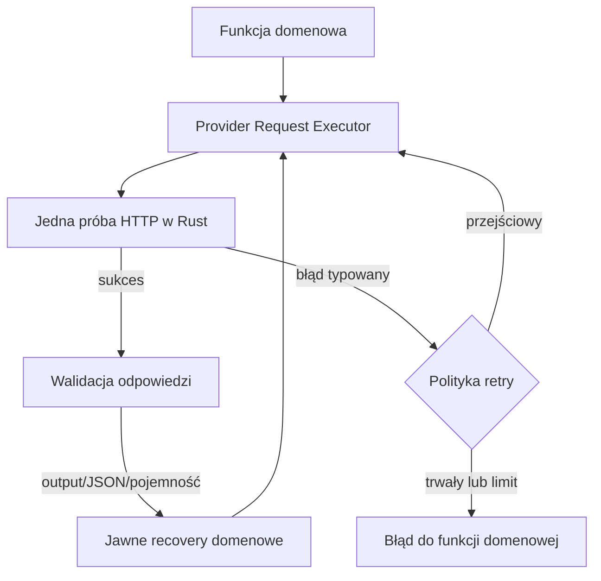

# Jednolita architektura retry providera — projekt końcowy

**Zakres:** AI RV Harness — publiczne v0.7.12 i prywatna baza testowa v0.7.13  
**Status:** zaimplementowano; w v0.7.13 trwa audyt zamykający  
**Cel:** jedna spójna obsługa przejściowych błędów providera we wszystkich wywołaniach inferencji, bez zagnieżdżonych retry i bez duplikowania danych sesji.

## Stan audytu — 2 września 2026

W prywatnej bazie v0.7.13 wykonano pierwsze utwardzenie po wdrożeniu:

- usunięto nieużywane helpery `shouldRetryProviderError` i `waitBeforeProviderRetry`;
- usunięto nieskuteczną kontrolę `activeLogicalRequests`, która sprawdzała nowo wygenerowany identyfikator;
- zachowano działającą ochronę brandowanego executora przed bezpośrednim opakowaniem executora drugim executorem;
- dodano automatyczny test granicy importów, który dopuszcza `providerChatAttempt` wyłącznie w `native.ts` i `requestExecutor.ts`;
- po zmianie przeszły typecheck, 79 plików testowych / 231 testów oraz build produkcyjny.

Do pełnego zamknięcia audytu pozostają macierze kontraktowe wszystkich rodzin wywołań, integracyjne testy cancellation i braku podwójnego zapisu oraz Rust/Tauri CI.

## 1. Decyzja w skrócie

Należy wprowadzić jeden wspólny executor wywołań providera w warstwie TypeScript, np. `src/providers/requestExecutor.ts`. Tylko ten executor może ponawiać to samo fizyczne żądanie po błędzie transportowym lub przejściowym błędzie usługi.

Warstwa Rust ma wykonać dokładnie jedną próbę HTTP i zwrócić ustrukturyzowany błąd. Kontrolery sesji nie mogą już posiadać własnych pętli retry. Mogą uruchamiać wyłącznie jawnie nazwane operacje naprawcze, które zmieniają żądanie, np. większy budżet outputu, naprawę JSON-u albo drugą próbę Viewer Notes po przekroczeniu pojemności.

To rozwiązanie obejmie:

- Conversation i Manual RV;
- Automatic RV, RV Lite, Custom i Telepathic;
- Viewera, AI Monitora i Special Tasks;
- automatyczną i ręczną analizę po Revealu;
- ocenę Monitora po Revealu;
- AI Judge;
- Viewer Notes reflection;
- Training i Research;
- wznowienie przerwanej sesji.

Nie obejmuje na tym etapie pobierania listy modeli ani testowania połączenia — są to operacje konfiguracyjne, a nie wywołania inferencji.

## 2. Co wykazała inspekcja obecnego kodu

### 2.1. Miejsce powstawania badanego błędu

W `src-tauri/src/providers.rs` funkcja `json_response()` wywołuje `response.text().await`. Komunikat:

```text
provider response body read failed: error decoding response body
```

oznacza, że odpowiedź HTTP została rozpoczęta, ale klient nie zdołał poprawnie odczytać lub zdekodować całego body. `reqwest` udostępnia osobne klasyfikatory `is_body()` i `is_decode()`, więc taki błąd można oznaczać typem bez rozpoznawania tekstu komunikatu. Jest to błąd odczytu transportowego, a nie błąd promptu, Revealu, schematu Judge ani pojemności Viewer Notes.

### 2.2. Retry jest obecnie rozproszone

| Obszar | Obecne zachowanie |
| --- | --- |
| Full RCP / Automatic RV | własne pętle retry w kontrolerze |
| RV Lite | własne pętle retry w kontrolerze |
| Custom | własna pętla retry w kontrolerze |
| Telepathic i resume | własne pętle retry w kontrolerze |
| AI Monitor podczas sesji | nie ponawia sam; liczy na pętlę kontrolera |
| post-Reveal Viewer / Monitor | tylko recovery po wyczerpaniu outputu; brak retry transportowego |
| AI Judge | tylko recovery outputu i naprawa domenowa JSON-u; brak retry transportowego |
| Viewer Notes | recovery outputu, naprawa JSON-u i retry pojemności; brak retry transportowego |
| Conversation / Manual RV | brak automatycznego retry; dostępne jest późniejsze ręczne ponowienie |

Ustawienie `maxRetries` dociera do głównych kontrolerów sesji, ale nie jest przekazywane do wszystkich etapów po Revealu, Judge i Viewer Notes. Dlatego ten sam błąd jest obsługiwany różnie zależnie od miejsca wystąpienia.

### 2.3. Obecna klasyfikacja miesza różne rodzaje odzyskiwania

`src/providers/retry.ts` zalicza obecnie zarówno błędy transportowe, jak i `reasoning without a final assistant response` oraz ucięty output do kategorii `single_recovery`. Jednocześnie `src/providers/outputRecovery.ts` ma własną próbę dla uciętego outputu.

Po dodaniu wspólnego retry bez rozdzielenia tych kategorii jedna awaria mogłaby zostać ponowiona przez obie warstwy. Tego należy uniknąć.

### 2.4. Dlaczego retry nie powinno znaleźć się w Rust

Warstwa Rust nie zna pełnego kontekstu operacji:

- ustawienia użytkownika `maxRetries`;
- granic etapów sesji i zasad wznowienia;
- audytu zdarzeń i numeracji prób;
- koszt guardu;
- różnicy między transport retry a naprawą outputu lub JSON-u.

Gdyby Rust sam ponawiał, a kontroler zachował swoją pętlę, próby zostałyby przemnożone. Rust powinien zatem wykonać jedno żądanie i precyzyjnie opisać wynik albo błąd; decyzja o retry należy do jednego wspólnego executora TypeScript.

## 3. Wnioski z innych projektów i dokumentacji

1. AWS opisuje klasyczny problem retry na kilku warstwach: trzy próby na pięciu poziomach mogą zwiększyć obciążenie dolnej usługi 243 razy. Zaleceniem jest retry w jednym miejscu oraz backoff z jitterem.  
   Źródło: [AWS Builders’ Library — Timeouts, retries, and backoff with jitter](https://aws.amazon.com/builders-library/timeouts-retries-and-backoff-with-jitter/).

2. Microsoft również zaleca unikanie zduplikowanych i kaskadowych warstw retry oraz ograniczenie liczby prób i czasu ich trwania.  
   Źródła: [Azure — Transient fault handling](https://learn.microsoft.com/en-us/azure/architecture/best-practices/transient-faults), [Azure — Retry Storm antipattern](https://learn.microsoft.com/en-us/azure/architecture/antipatterns/retry-storm/).

3. Oficjalne SDK OpenAI centralizują retry w kliencie. Domyślnie ponawiają przejściowe błędy połączenia oraz HTTP 408, 409, 429 i 5xx, stosując krótki exponential backoff; retry można skonfigurować dla klienta albo pojedynczego żądania.  
   Źródło: [OpenAI Node — Client configuration, retries and timeouts](https://github.com/openai/openai-node/blob/main/docs/configuration.md).

4. Vercel AI SDK wystawia jedno `maxRetries` dla operacji generowania, domyślnie 2. To potwierdza wartość wspólnego punktu wykonania zamiast pętli rozsianych po funkcjach domenowych.  
   Źródło: [AI SDK Core — generateText](https://ai-sdk.dev/docs/reference/ai-sdk-core/generate-text).

5. Popularna biblioteka open source `p-retry` rozdziela wykonanie, decyzję `shouldRetry`, zużycie budżetu, callback błędu, backoff i anulowanie. Ten podział jest dobrym wzorcem API dla naszego executora, ale nie ma potrzeby dodawania tej zależności — mechanizm Harnessu wymaga własnego audytu i cost guardu.  
   Źródło: [sindresorhus/p-retry](https://github.com/sindresorhus/p-retry).

6. OpenRouter udostępnia stabilne `error_type` i zaleca opierać klasyfikację na nim, nie wyłącznie na statusie HTTP. `rate_limit_exceeded` wymaga respektowania `Retry-After`, a `provider_overloaded`, `provider_unavailable` i `timeout` są przejściowe. OpenRouter sam wykonuje provider fallback dla tego samego modelu, gdy może to zrobić przed rozpoczęciem odpowiedzi. Po rozpoczęciu odpowiedzi zerwane połączenie może już dotrzeć do klienta.  
   Źródła: [OpenRouter — Error handling and debugging](https://openrouter.ai/docs/api_reference/errors-and-debugging), [OpenRouter — Provider routing](https://openrouter.ai/docs/guides/routing/provider-selection), [OpenRouter — Rate limits](https://openrouter.ai/docs/api_reference/limits).

7. Google zaleca retry tylko wtedy, gdy jednocześnie pasuje rodzaj błędu i bezpieczeństwo powtórzenia operacji; rekomenduje exponential backoff z jitterem i ostrzega przed nakładaniem retry aplikacji na retry klienta.  
   Źródło: [Google Cloud — Retry strategy](https://docs.cloud.google.com/storage/docs/retry-strategy).

## 4. Architektura docelowa



### 4.1. Rust: jedna próba i typowany błąd

`provider_chat` nie otrzymuje pętli retry. Zamiast błędu tekstowego zwraca serializowalny obiekt, np.:

```ts
type ProviderCallError = {
  code:
    | "connect"
    | "timeout"
    | "request_send"
    | "response_body_read"
    | "response_body_decode"
    | "invalid_provider_json"
    | "http_status"
    | "cancelled"
    | "configuration";
  message: string;
  httpStatus?: number;
  providerErrorType?: string;
  providerCode?: string;
  retryAfterMs?: number;
  providerRequestId?: string;
  phase: "before_dispatch" | "awaiting_headers" | "reading_body" | "parsing_body";
};
```

Wykorzystujemy `reqwest::Error::is_connect()`, `is_timeout()`, `is_body()` i `is_decode()`. Tekst komunikatu pozostaje dla człowieka, ale kod nie podejmuje decyzji na podstawie angielskich fragmentów tekstu. Dla zgodności można przez jeden cykl wydawniczy zachować parser starych stringów jako fallback.

Identyfikator odpowiedzi należy pobrać z nagłówków przed czytaniem body i dołączać także do błędu odczytu. Ułatwi to diagnozę po stronie OpenRoutera lub innego providera.

### 4.2. TypeScript: jeden `executeProviderRequest()`

Nowy executor jest jedynym właścicielem transport retry. Otrzymuje:

- dokładny, niemutowalny request;
- `configuredRetries` z ustawień;
- `AbortSignal`;
- `operationId`, nazwę etapu i rolę (`viewer`, `monitor`, `judge`, `notes`);
- callbacki `beforeAttempt`, `onAttemptSuccess`, `onAttemptFailure`;
- opcjonalne podłączenie cost guardu i metryk.

Zwraca odpowiedź oraz raport prób:

```ts
type ProviderExecutionResult = {
  response: ProviderChatResponse;
  logicalRequestId: string;
  physicalAttempts: number;
  recoveredFrom?: ProviderFailureClass;
};
```

Każda fizyczna próba ma własny `requestId`, ale wszystkie próby tego samego payloadu mają wspólny `logicalRequestId` i hash requestu. Executor sprawdza, że retry wysyła identyczny model, wiadomości i ustawienia.

### 4.3. Trzy rozłączne mechanizmy

| Mechanizm | Właściciel | Czy payload się zmienia? | Przykład |
| --- | --- | --- | --- |
| Transport retry | `requestExecutor` | nie | body decode, reset, 429, 503 |
| Output recovery | `outputRecovery` | tak | 8192 → 16384 tokenów |
| Recovery domenowe | Judge / Notes / parser domenowy | tak | JSON repair, capacity retry |

`outputRecovery` nie może klasyfikować błędów sieciowych. Executor nie może klasyfikować `finish_reason=length`, złego schematu Judge ani przekroczenia pojemności notatek jako transportu.

Nowy prompt naprawczy jest nowym logicznym żądaniem, więc może mieć własną pojedynczą ochronę transportową. Nie jest to przypadkowe zagnieżdżenie: w logu występuje jako np. `semanticAttempt=json_repair`, a wszystkie fizyczne próby są policzone. Dodatkowo na poziomie operacji obowiązuje jawny plan dozwolonych recovery; nie ma ogólnego `while` ani rekurencji.

### 4.4. Ochrona przed ponownym zagnieżdżeniem

Należy zastosować cztery zabezpieczenia:

1. usunąć pętle transportowe z kontrolerów sesji;
2. nie eksportować niskopoziomowego `nativeProviderChat` poza moduł providera — pozostały kod importuje executor;
3. dodać `RetryContext`/ledger z `operationId`, `logicalRequestId`, numerem fizycznej próby i nazwą recovery;
4. dodać test, który celowo łączy transport failure z output recovery i sprawdza dokładną liczbę wywołań.

W trybie developerskim executor powinien odrzucić próbę uruchomienia z aktywnym kontekstem retry tego samego `logicalRequestId`. To wykryje przyszłe przypadkowe opakowanie executora kolejną pętlą.

## 5. Końcowa polityka retry

`maxRetries` nadal oznacza liczbę ponowień po pierwszym wywołaniu. Wartość `0` wyłącza automatyczne retry zgodnie z jawnym wyborem użytkownika. Domyślna wartość pozostaje `2`.

| Błąd | Polityka |
| --- | --- |
| DNS/connect/TLS/send przed uzyskaniem odpowiedzi | do `maxRetries` |
| HTTP 408, 425, 429, 500, 502, 503, 504 | do `maxRetries` |
| OpenRouter `rate_limit_exceeded`, `provider_overloaded`, `provider_unavailable`, `timeout`, `server` | do `maxRetries` |
| `response_body_read`, `response_body_decode`, unexpected EOF, reset/close podczas body | najwyżej 1 retry, nawet gdy ustawiono więcej |
| niepoprawny JSON całej odpowiedzi providera | najwyżej 1 retry; jest to uszkodzona odpowiedź transportowa/provider payload |
| pusta odpowiedź asystenta bez blokady bezpieczeństwa | najwyżej 1 retry |
| `finish_reason=length`, reasoning bez finalnej odpowiedzi | bez transport retry; jedno output recovery z większym budżetem |
| niepoprawny JSON Judge/Notes po poprawnym odczycie odpowiedzi | bez transport retry; najwyżej jedna jawna naprawa JSON |
| przekroczenie pojemności Viewer Notes | bez transport retry; druga i ostatnia próba pojemności zgodnie z istniejącym projektem |
| 400, 401, 402, 403, 404, 422; zły model; zły parametr; context length; safety/refusal | nigdy automatycznie |
| anulowanie użytkownika, cost limit, route mismatch | nigdy automatycznie |

Nie należy automatycznie zmieniać modelu. Zmiana modelu naruszyłaby tożsamość Viewera, porównywalność Research, Session Snapshot i Viewer Notes. OpenRouter może wykonać provider fallback dla tego samego modelu zgodnie ze swoją konfiguracją, ale Harness nie powinien sam przełączać na inny model.

## 6. Backoff, `Retry-After` i limit czasu

1. Jeśli odpowiedź zawiera poprawne `Retry-After`, należy odczekać co najmniej wskazany czas, z limitem 30 sekund.
2. Bez nagłówka stosować capped exponential backoff z full jitter:
   - baza 500 ms;
   - limit 8 s;
   - losowanie opóźnienia w ograniczonym przedziale dla każdej próby.
3. Pojedyncze niejednoznaczne body/decode recovery powinno mieć krótki backoff około 500–1000 ms.
4. `AbortSignal` przerywa zarówno aktywne żądanie, jak i oczekiwanie między próbami.
5. Każda próba zachowuje obecny timeout requestu. Raport operacji pokazuje łączny czas wszystkich prób.

Obecny backoff 150/300/600 ms bez jitteru należy zastąpić. Przy przeciążeniu zbyt szybkie, zsynchronizowane ponowienia mogą pogorszyć sytuację.

## 7. Koszt i niejednoznaczność ponowienia POST

Po błędzie odczytu body nie można mieć pewności, czy model wykonał generację i czy provider naliczył koszt. Dlatego:

- taki błąd ma najwyżej jedną automatyczną próbę;
- audyt oznacza pierwszą próbę jako `billingStatus: unknown`;
- Session Cost Guard zachowuje konserwatywne rozliczenie górnym limitem dla nieudanej próby — obecna metoda `CostAuthorization.failure()` już rezerwuje maksymalny koszt, więc nie należy jej osłabiać;
- UI może w szczegółach technicznych pokazać „recovered after ambiguous provider response; previous attempt may have been billed”;
- metryki powinny rozróżniać `logicalRequestCount`, `physicalAttemptCount` i `ambiguousBillingAttemptCount`.

To ważne szczególnie w Training, gdzie wiele celów wykonuje się kolejno.

## 8. Zasady zapisu i wznowienia

- Wiadomość użytkownika lub krok kontrolera jest zapisywany raz przed wejściem do executora.
- Nieudane fizyczne próby zapisują wyłącznie zdarzenie techniczne; nie dopisują kolejnej wiadomości do transcriptu.
- Odpowiedź asystenta jest zapisywana dopiero po otrzymaniu kompletnego, zaakceptowanego body.
- Retry Monitora nie powtarza wcześniejszej pracy Viewera.
- Retry post-Reveal nie dopisuje drugi raz tego samego pytania.
- Retry Judge nie zamraża częściowego wyniku; istniejąca zasada zamrożenia całej poprawnej grupy pozostaje.
- Retry Viewer Notes nie tworzy wersji przed walidacją i atomowym commit.
- Przerwanie po wyczerpaniu retry zachowuje sesję i dotychczasowe checkpointy; istniejący resume rozpoczyna się od pierwszego brakującego logicznego żądania.

## 9. Plan zmian w kodzie

### Etap A — typowane błędy

- dodać serializowalny typ błędu w `src-tauri/src/providers.rs`;
- zachować request ID, status, `Retry-After` i OpenRouter `error_type`;
- rozróżnić błąd odczytu/dekodowania body od błędu parsowania JSON;
- znormalizować ten obiekt w `src/providers/native.ts`.

### Etap B — wspólny executor

- utworzyć `src/providers/requestExecutor.ts`;
- przenieść do niego klasyfikację, limit prób, backoff, jitter, anulowanie i raport prób;
- przebudować `src/providers/retry.ts` na typowaną politykę bez błędów domenowych;
- pozostawić zgodnościowy parser starych stringów tylko jako fallback.

### Etap C — migracja konsumentów

- zastąpić bezpośrednie wywołania `nativeProviderChat` executorem;
- usunąć pętle retry z RCP, Lite, Custom i Telepathic;
- przepiąć Monitor, Conversation/Manual RV, post-Reveal, Judge i Viewer Notes;
- przekazywać `settings.maxRetries`, timeout i signal także do post-Reveal, Judge i Notes;
- zachować callbacki audytu, metryk oraz cost guardu na poziomie pojedynczej fizycznej próby.

### Etap D — testy i dokumentacja

- testy jednostkowe polityki i executora;
- kontraktowe testy wszystkich rodzin wywołań;
- testy dokładnej liczby fizycznych prób;
- testy resume i braku podwójnych zapisów;
- aktualizacja dokumentacji ustawienia retry i komunikatów UI.

## 10. Wymagane testy akceptacyjne

1. Body decode w Automatic RV: 2 fizyczne próby, 1 zapis odpowiedzi.
2. Body decode w Reveal Viewer review: 2 próby, 1 zapis pytania i 1 odpowiedzi.
3. To samo dla Monitor review, Judge, Notes, Conversation i Manual RV.
4. `maxRetries=0`: dokładnie 1 fizyczna próba.
5. `maxRetries=5` + body decode: nadal najwyżej 2 fizyczne próby.
6. `503` dwa razy, potem sukces przy `maxRetries=2`: dokładnie 3 próby.
7. `401`, safety, context length i cost limit: dokładnie 1 próba.
8. `Retry-After`: następna próba nie rozpoczyna się przed wskazanym terminem.
9. Anulowanie podczas backoffu: brak następnego wywołania.
10. Ucięty output, potem sukces po zwiększeniu budżetu: 2 logiczne żądania, bez transport retry.
11. Body decode podczas drugiego żądania output recovery: 3 fizyczne próby łącznie, nie 4 ani 6.
12. Zły JSON Judge: 1 żądanie oceny + 1 jawny JSON repair; każda warstwa ma opisany osobny identyfikator.
13. Capacity retry Notes otrzymuje pełne dane sesji i nie jest mylone z transport retry.
14. Retry Monitora nie powtarza Viewera.
15. Resume po wyczerpaniu retry odtwarza zapisane odpowiedzi i wywołuje provider tylko dla brakującego kroku.

Testy powinny zawierać wspólną tabelę wszystkich publicznych ścieżek inferencji. Dodanie w przyszłości nowej ścieżki bez executora ma powodować błąd testu lub reguły importów.

## 11. Stopień skomplikowania

**Ocena: średnio-wysoki, około 7/10.**

Sama pętla retry jest prosta. Trudność polega na bezpiecznym usunięciu wielu obecnych pętli, zachowaniu cost guardu, metryk, autosave i resume oraz na rozdzieleniu transport retry od trzech istniejących recovery domenowych.

Nie jest to przebudowa protokołu RV ani bazy danych. Przy zachowaniu istniejących interfejsów repozytorium prawdopodobnie nie będzie potrzebna migracja SQLite. Zmiana dotknie jednak centralnych kontrolerów i wymaga pełnej regresji wszystkich typów sesji.

## 12. Kryterium gotowości

Rozwiązanie jest gotowe, gdy:

- żadne wywołanie inferencji nie importuje bezpośrednio `nativeProviderChat` poza modułem executora;
- w kodzie kontrolerów nie ma pętli transport retry;
- każdy błąd ma typ, retryability i jednoznacznego właściciela;
- wszystkie ścieżki respektują jedno ustawienie `maxRetries`;
- testy potwierdzają dokładne liczby wywołań i brak duplikatów danych;
- `provider response body read failed: error decoding response body` jest automatycznie ponawiany raz w dowolnym etapie, o ile użytkownik nie ustawił `maxRetries=0`;
- po drugiej porażce sesja jest bezpiecznie przerywana lub pozostawia ręczne ponowienie/resume, bez utraty wcześniej zapisanej pracy.

## 13. Rekomendacja końcowa

Nie należy dodawać kolejnego lokalnego `try/catch` tylko do Revealu ani wstawiać retry bezpośrednio do Rust. Należy wykonać jedną kontrolowaną refaktoryzację: typowane błędy z Rust, jeden executor retry w TypeScript, usunięcie pętli transportowych z kontrolerów i jawne pozostawienie recovery domenowych.

To jest większe niż szybka łatka jednego komunikatu, ale jest właściwym rozwiązaniem „raz a dobrze”. Usuwa przyczynę niespójności i sprawia, że następna nowa funkcja AI odziedziczy poprawne retry bez kopiowania kolejnej pętli.
